How to install DBeaver for MSSQL.

Click [Next] button
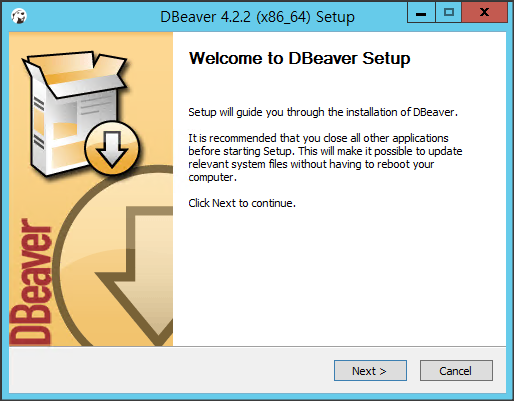

Read license and click [I Agree] button
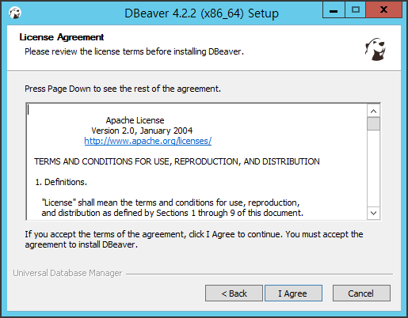

Choose installation option and click [Next >] button
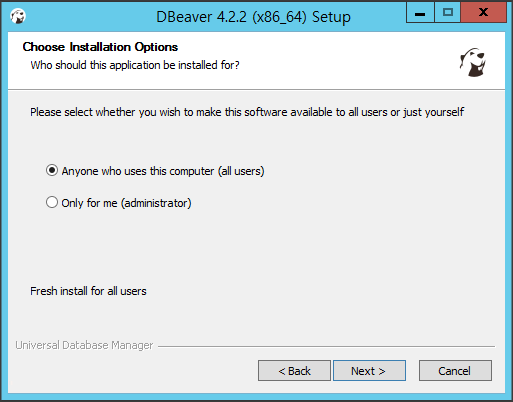

Choose components and click [Next >] button. If you choose JRE, JRE will be installed in subfolder of DBeaver.
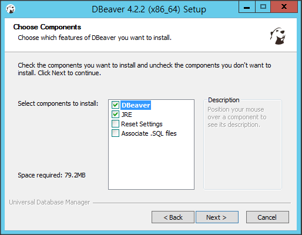

Choose install location and click [Next >] button
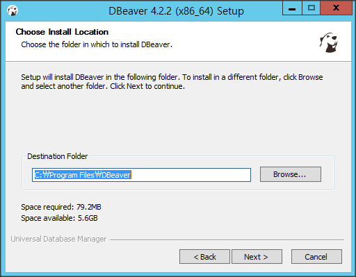

Choose start menu folder and click [Install] button.
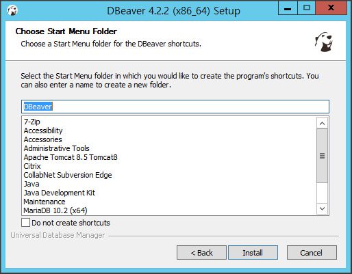

Wait until installation completed
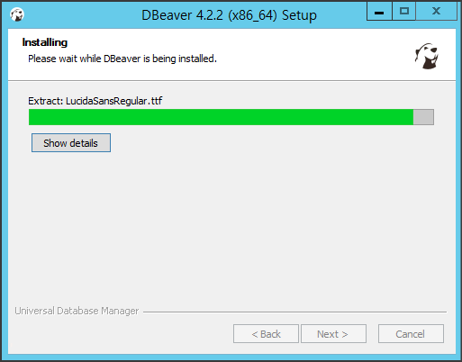

Click [Finish] button
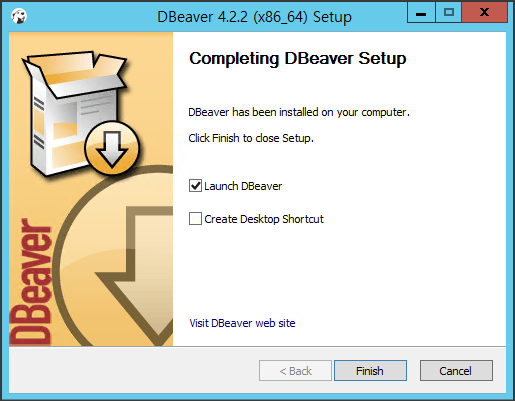

If you check "Launch DBeaver" in above step, you will see the flash screen.
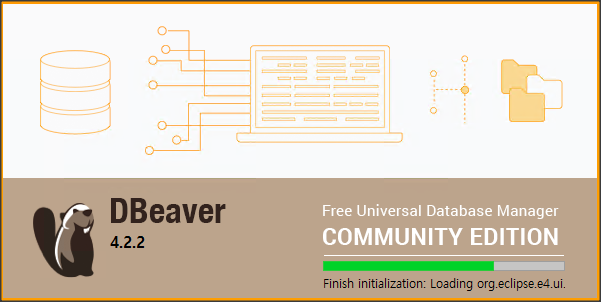

Download Microsoft JDBC driver from [Microsoft](https://docs.microsoft.com/ko-kr/sql/connect/jdbc/microsoft-jdbc-driver-for-sql-server)

Click menu > Driver Manager > MS SQL Server > Microsoft Driver and click [Edit...] button
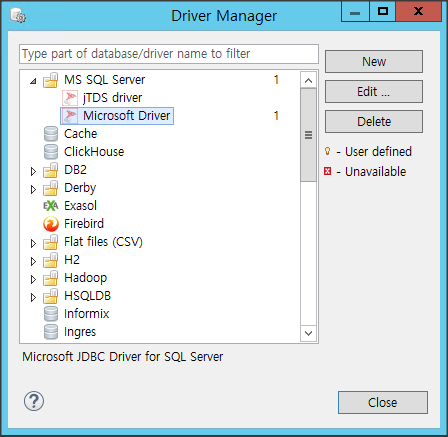

Select mssql-jdbc-x.x.x.jrex.jar which is extracted from Microsoft JDBC driver and click OK
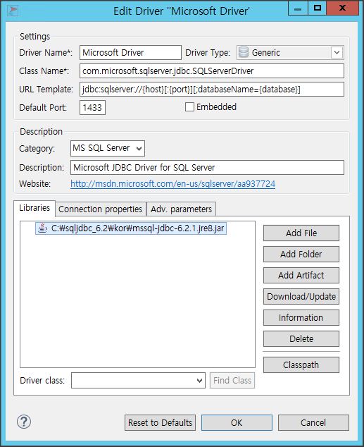

