# 톰캣 다운로드
아파치 톰캣의 공식 에 접속하면 아래와 같이 톰캣의 각 버전별로 다운로드 할 수 있는 링크가 보인다.

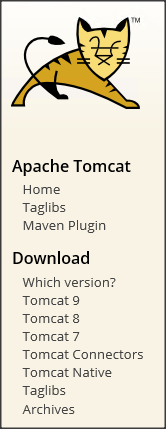

다운로드할 버전(8.5)를 선택하면 아래와 같이 패키지 타입이 여러개 보이는데 맨 아래에 있는 32-bit/64-bit Windows Service Installer를 선택하여 설치 파일을 다운로드 한다.

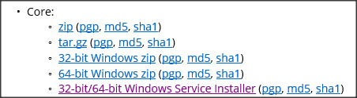

다운로드한 설치 파일을 실행하면 아래와 같이 셋업 화면이 뜬다.

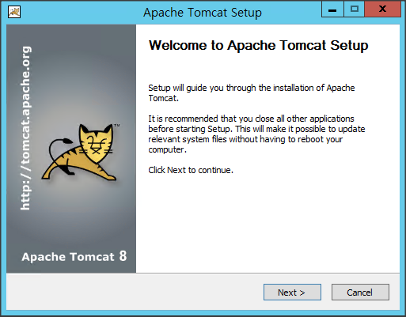

[Next >] 버튼 클릭

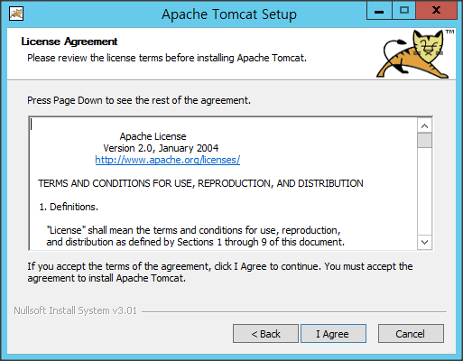

라이센스 내용 확인 후 [I Agree] 버튼 클릭

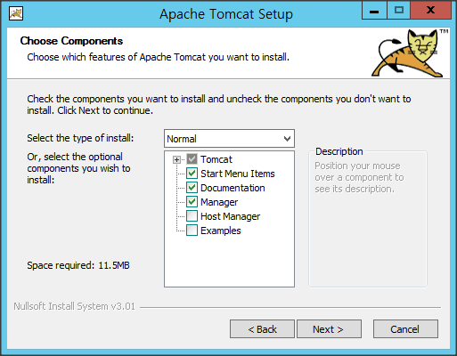

설치할 컴포넌트 선택 후 [Next >] 버튼 클릭
> 일반적으로 Manager만 설치해면 되나 필요에 따라 Host Manager를 설치한다

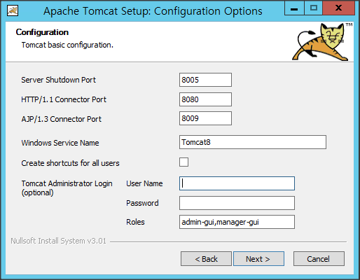

웹 페이지를 통한 관리를 할 예정이라면 User Name, Password 입력하고, 기타 설정 값 확인 후 [Next >] 버튼 클릭
> 개발 환경에서는 웹 페이지를 통한 관리가 편할 수 있으나 운영 환경에서는 보안상 설정하지 않는 경우가 많다
> Manager가 없는 환경에서 어플리케이션 배포와 운영은 스크립트등을 사용하여 수동으로 운영한다

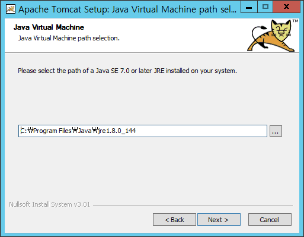

JRE 설치된 위치 확인하고 [Next >] 버튼 클릭

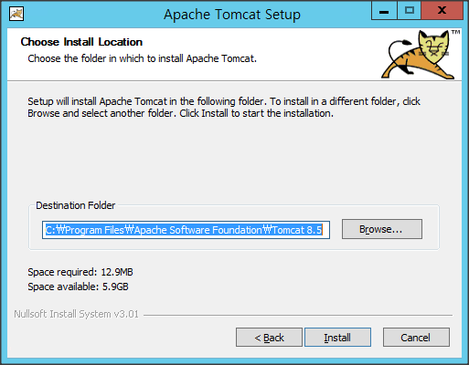

설치 위치 확인하고 [Install] 버튼 클릭
> 운영할 어플리케이션에 따라 설치 위치를 C:\Tomcat과 같이 공백이 없는 곳에 설치하는 것이 필요할 수도 있다. 따라서 운영 환경이라면 공백이 없는 설치 위치를 잡는 것이 좋다

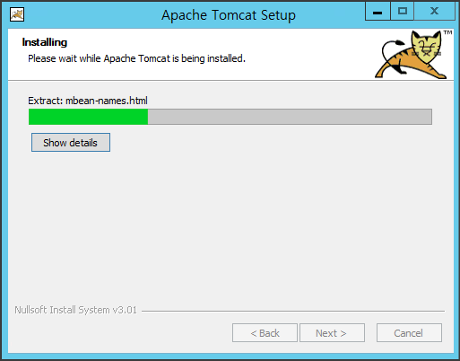

설치 과정 화면에서 잠시 기다린다

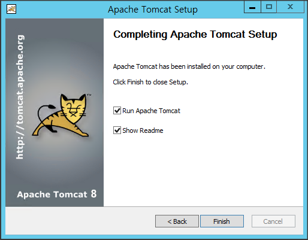

[Finish] 버튼을 클릭. 설치가 되어 톰캣이 정상적으로 실행되었는지 확인하기 위해 아래와 같이 접속해 본다.

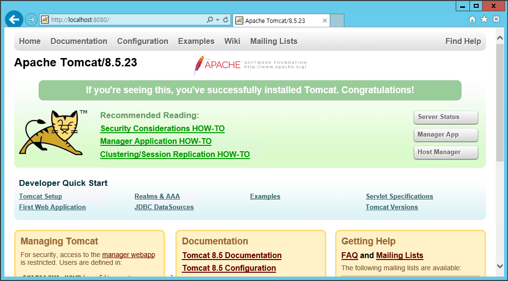

만약 메니저를 함께 설치했다면 우측 Manager App 버튼을 클릭하고 설치시 입력한 Username, Password를 입력하고 아래와 같이 메니저가 정상적으로 실행되는지 확인한다.

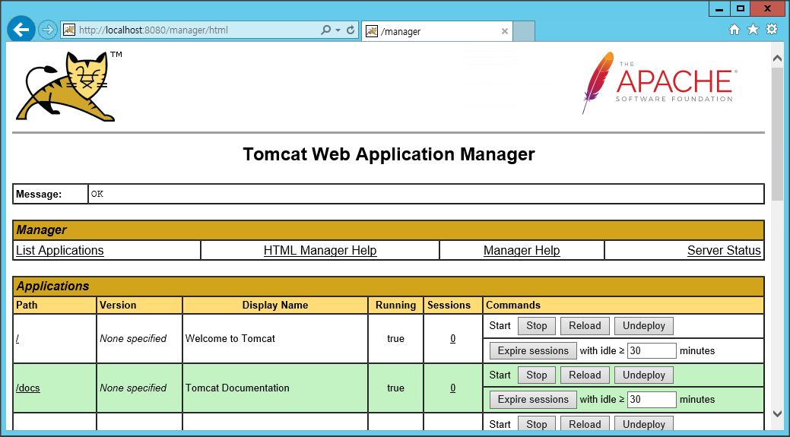

톰캣 메니저를 통해 50MB 이상의 WAR 파일을 배포하기 위해서는 아래 위치에 있는 메니저의 web.xml을 열고

(톰캣 설치 디렉토리)/webapps/manager/WEB-INF/web.xml

multiplart-config에 있는 max-file-size와 max-request-size의 50MB 제한을 늘려주고, Tomcat 서비스를 재시작 해야 한다.

```
<multipart-config>
  <!-- 50MB max -->
  <max-file-size>52428800</max-file-size>
  <max-request-size>52428800</max-request-size>
  <file-size-threshold>0</file-size-threshold>
</multipart-config>
```
